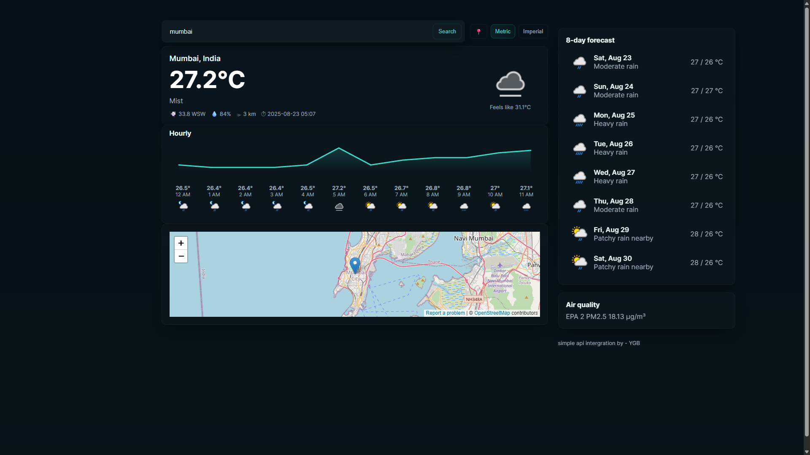

# 🌙 Weather App  

🔗 **Live Demo:** [Weather App on Vercel](https://weather-app-cyan-zeta-65.vercel.app/)  

A simple **weather web app** that shows current weather, forecasts, alerts, and an interactive **map view** using **WeatherAPI.com**, deployed securely on **Vercel** with API key protection.  

---

## 📌 Features
- 🌡️ Current temperature, condition, humidity, and wind  
- ⏰ Hourly forecast (graph)  
- 📅 8-day forecast  
- ⚠️ Weather alerts (if available)  
- 🗺️ Interactive location map with marker (city searched shown on map)  
- 🌙 Dark theme UI for modern look  
- 🔒 Secure serverless proxy (API key hidden in backend)  

---

## 📸 Screenshot  

  
*(Dark UI with weather details, forecast chart, and map marker)*  

---

## 📂 Project Structure
```
weather-app/
├─ api/
│  └─ weather.js           # Vercel serverless function (proxy to WeatherAPI)
├─ public/
│  ├─ index.html           # Main frontend (dark theme)
│  └─ screenshot.png       # App preview image
├─ server.js               # Optional local Express server for dev
├─ package.json
├─ package-lock.json
├─ .gitignore
└─ README.md
```

---

## 🚀 How It Works
1. User searches for a city.  
2. Frontend sends request → `/api/weather?q=City&days=8`.  
3. `api/weather.js` fetches data from **WeatherAPI** using the secret key stored in **Vercel environment variables**.  
4. JSON response is sent back to frontend.  
5. UI updates with **charts, forecasts, alerts, and map location marker**.  

---

## 🛠️ Local Development

1. **Clone the repo**
   ```bash
   git clone https://github.com/<your-username>/<repo>.git
   cd <repo>
   ```

2. **Install dependencies**
   ```bash
   npm install
   ```

3. **Set up environment variable**  
   Create a `.env.local` file (git-ignored):
   ```
   WEATHER_API_KEY=your_real_weatherapi_key
   ```

4. **Run locally**
   ```bash
   # macOS/Linux
   export WEATHER_API_KEY="your_real_key_here"
   node server.js

   # Windows PowerShell
   $env:WEATHER_API_KEY="your_real_key_here"
   node server.js
   ```

   Open: [http://localhost:3000/index.html](http://localhost:3000/index.html)

Or run with Vercel CLI:
   ```bash
   vercel dev
   ```

---

## 🌍 Deployment on Vercel

1. Push your project to **GitHub**.  
2. Go to [Vercel](https://vercel.com) → Import Project → select your repo.  
3. In **Project → Settings → Environment Variables**, add:
   ```
   WEATHER_API_KEY=your_real_weatherapi_key
   ```
4. Deploy project.  
5. Access your app at:
   ```
   https://your-project-name.vercel.app/
   ```

✅ Test API endpoint directly:
```bash
curl "https://your-project-name.vercel.app/api/weather?q=London&days=1"
```

---

## ⚡ Optimization
- API responses cached with headers:  
  `Cache-Control: s-maxage=60, stale-while-revalidate=120`  
- Adjust caching in `api/weather.js` to avoid rate limits.  

---

## 🐞 Troubleshooting
- ❌ **"Missing WEATHER_API_KEY"** → Add key in `.env.local` or Vercel env vars.  
- ❌ **401 Unauthorized** → Wrong or inactive API key.  
- ❌ **429 Too Many Requests** → Free WeatherAPI plan limit exceeded, increase caching.  
- ✅ Debug with:
  ```bash
  curl "http://localhost:3000/api/weather?q=London&days=1"
  ```

---

## 📜 License
MIT — free for personal and commercial use.  

---

✨ Built with **HTML, CSS, JavaScript, Node.js, and Vercel Serverless Functions**  
